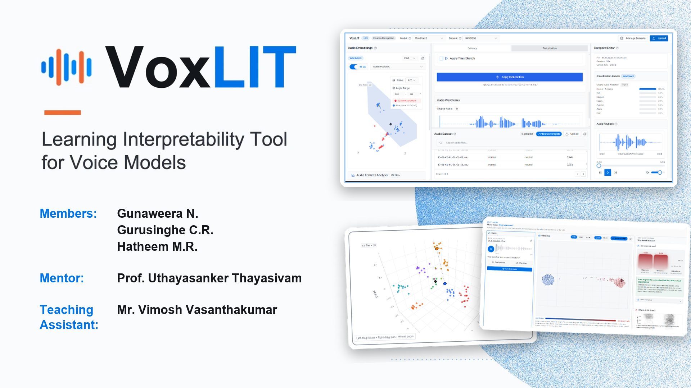

<p align="center">
  
</p>

<h1 align="center">VoxLIT</h1>

<p align="center"><strong>Learning Interpretability Tool for Voice Models</strong></p>

<p align="center">
  
  <a href="LICENSE"></a>
  
  
  
</p>

<p align="center">
  <a href="#overview">Overview</a> &nbsp;·&nbsp;
  <a href="#task-workbenches">Task Workbenches</a> &nbsp;·&nbsp;
  <a href="#interpretability-toolkit">Toolkit</a> &nbsp;·&nbsp;
  <a href="#research-practice">Research Practice</a> &nbsp;·&nbsp;
  <a href="#deployment">Deployment</a> &nbsp;·&nbsp;
  <a href="#authors">Authors</a>
</p>

---

## Overview

Interpretability tools such as Google's Learning Interpretability Tool (LIT) have made text and tabular models far easier to inspect, but speech models have no equivalent. Audio adds difficulties of its own: decisions unfold over time, the same signal can be read as a waveform or a spectrogram, and a model can score well by exploiting recording artefacts rather than the voice itself.

VoxLIT brings interactive interpretability to speech. It pairs each model's predictions with the evidence behind them (attention, attribution over time, embedding geometry and controlled perturbations) so that researchers can test *why* a model decides, not only *what* it decides.

## Task Workbenches

VoxLIT is organised as a homepage and five task workbenches. Each workbench ships with its own models, a reference dataset, and analyses suited to the task.

| Task | Models | Reference data | Analyses |
| :--- | :--- | :--- | :--- |
| **Speech Transcription** | Whisper base, Whisper large-v3 | Common Voice | Predictions and confidence, attention, saliency, perturbations |
| **Emotion Recognition** | wav2vec2 | RAVDESS | Class probabilities, attention, embeddings, saliency, perturbations |
| **Speaker Verification** | ECAPA-TDNN, ResNet34-LM | VoxCeleb1 demo subset | Similarity scores, calibrated thresholds, EER / FAR / FRR, perturbation sweeps |
| **Speaker Diarization** | pyannote 3.1, Reverb v1, Reverb v2 | AMI subset | Speaker timelines, cluster saliency and compactness, before/after perturbation |
| **Audio Deepfake Detection** | wav2vec2 XLS-R, AST, XLSR-Mamba, Wav2Vec2-AASIST, XLSR-SLS, Nes2Net-X | ASVspoof 2019 LA subset | Six-detector comparison, silence ablation, time-aligned attribution, embedding maps, EER and DET analysis per attack |

## Interpretability Toolkit

- **Prediction analysis.** Scores, confidence and decisions at an adjustable threshold.
- **Attention visualisation.** Attention patterns in transformer-based audio models.
- **Attribution over time.** Gradient-based saliency aligned with the waveform, with the attribution method named in the interface.
- **Embedding analysis.** The representation a model's classifier reads, projected to 2D or 3D.
- **Perturbation and ablation.** Controlled edits (noise, filtering, silence removal and more) to test which parts of the signal a decision depends on.
- **Evaluation.** Error rates with confidence intervals, DET curves and per-condition breakdowns.

## Research Practice

VoxLIT is designed to support honest model analysis:

- **Faithful model loading.** Released checkpoints are loaded strictly, so a missing layer fails loudly instead of silently producing random scores. Model revisions are pinned to exact commits.
- **Ground truth stays hidden per clip.** Per-clip views show only the model's own verdict; labels are used offline, for aggregate evaluation only.
- **Stated methods and limits.** Every attribution names its method, its duration cap and its known biases.
- **Shortcut detection.** Ablations such as the silence probe expose detectors that rely on dataset artefacts rather than on speech.

## Architecture

| Layer | Technologies |
| :--- | :--- |
| Frontend | React 18, TypeScript, Vite, React Router, TanStack Query |
| Interface | Tailwind CSS, shadcn/ui, Motion |
| Visualisation | Recharts, Plotly.js, Three.js (react-three-fiber), wavesurfer.js |
| Backend | FastAPI, Python 3.11 |
| Machine learning | PyTorch, Hugging Face Transformers, pyannote.audio, Captum, scikit-learn, UMAP, librosa |
| Caching | Redis |
| Hosting | Modal (frontend, API and Redis in a single container behind nginx) |
| Testing | Vitest, pytest |

## Repository Layout

| Path | Contents |
| :--- | :--- |
| `Frontend/src/features/` | One folder per task workbench |
| `Frontend/src/components/` | Shared interface, audio and visualisation components |
| `Frontend/src/tasks/` | Frontend task registry |
| `Frontend/src/pages/` | Homepage, task page and help portal |
| `Backend/app/tasks/` | Per-task routers, models and services, plus the task registry |
| `Backend/app/api/`, `Backend/app/services/` | Shared API routes and services |
| `Backend/scripts/` | Dataset download and preparation scripts |
| `Backend/tests/` | Backend test suite |
| `deploy/` | Modal deployment, nginx configuration and model checks |

See [STRUCTURE.md](STRUCTURE.md) for the task registry and for adding a new task, model or dataset.

## Deployment

VoxLIT is hosted on [Modal](https://modal.com). Model weights are stored on a persistent volume, so they download once and survive restarts. The Hugging Face token for gated models is provided as a Modal secret.

## Development

For contributors working on the codebase:

**1. Frontend**

```bash
cd Frontend
npm install
npm run dev
```

**2. Redis** (Docker Desktop must be running)

```bash
cd Backend
docker compose up -d
```

**3. Backend**

```bash
cd Backend
python3.11 -m venv .venv
source .venv/bin/activate        # Windows: .venv\Scripts\activate
python -m pip install --upgrade pip
pip install -r requirements.txt
uvicorn app.main:app --reload
```

| Command | Purpose |
| :--- | :--- |
| `npm test` | Frontend tests (Vitest) |
| `npm run build` | Production build of the frontend |
| `npm run lint` | ESLint |
| `pytest` | Backend tests, run from `Backend/` |

## Contributing

Contributions are welcome. Please read the [Contributing Guidelines](CONTRIBUTING.md) and the [Code of Conduct](CODE_OF_CONDUCT.md) before opening a pull request.

## Security

To report a vulnerability, please follow the [Security Policy](SECURITY.md).

## Authors

| Role | Name |
| :--- | :--- |
| Members | Gunaweera N. <br> Gurusinghe C.R. <br> Hatheem M.R. |
| Mentor | Prof. Uthayasanker Thayasivam |
| Teaching Assistant | Mr. Vimosh Vasanthakumar |

## Acknowledgments

- Inspired by Google's [Learning Interpretability Tool (LIT)](https://github.com/PAIR-code/lit).
- Built on open models and datasets from the speech research community, including Whisper, wav2vec2, pyannote, VoxCeleb, AMI, RAVDESS, Common Voice and ASVspoof.

## License

Released under the MIT License. See [LICENSE](LICENSE) for details.
